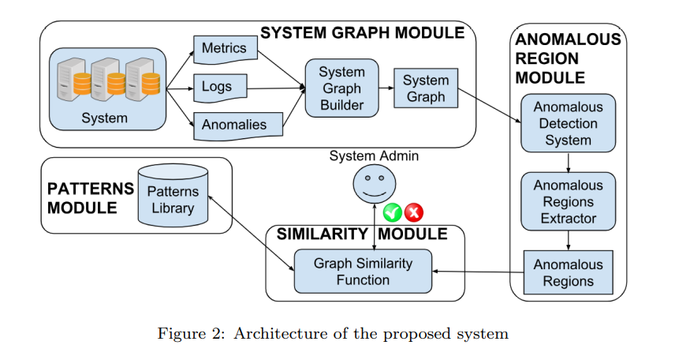
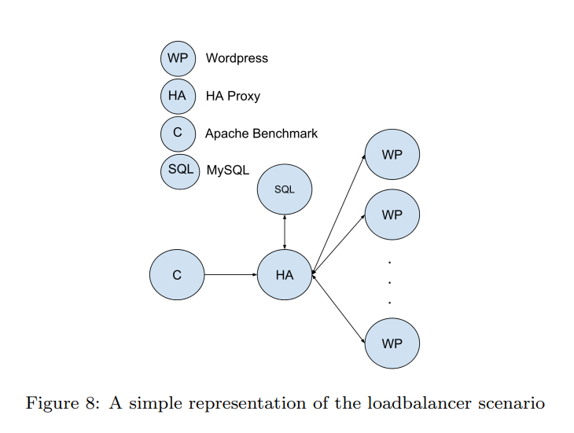
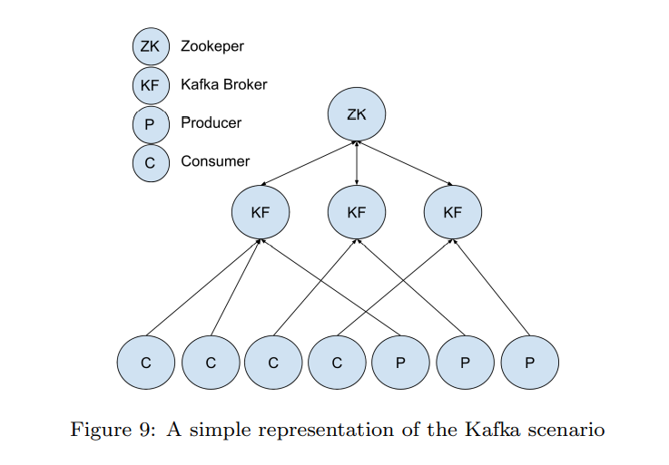
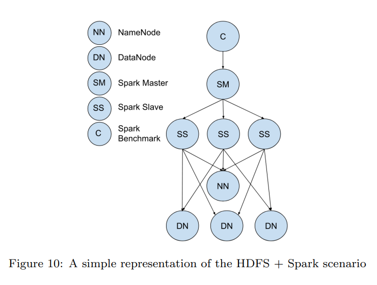

## Graph-based Root Cause Analysis for Service-Oriented and Microservice Architectures

> shangchao

所有的RCA(Root Cause Analysis根因分析)可以根据不同的特点分为几类；

一种分类方法是诊断模型是否知道所分析系统的结构；这种叫做基于模型的方法；

- 基于模型的方法：根因分析模型需要以被分析系统的结构为基础
  - 9、10、11、12；

- 基于分类的方法（模型无关方法）：通常使用ML等方法
  - 13、14
- 之前的方法多数使用 Probabilistic Graphical Models模型
  - 15、16、17

20、

34、35：benchmark、injection

39：microservice系统，数据收集、找到服务之间的依赖关系；

##### 图相似性、图匹配

这部分内容主要是设想通过将微服务系统建模成网络结构，然后根据正常状态的子图与异常时刻的子图做图相似性对比；

利用图矩阵的特征值，或者图转化成向量的相似度；

通过系统图构建的根因分析大致模块：

- system graph module：系统图生成模块
- anomalous region module：故障定位模块
- patterns module：已有模式模块
- similarity module：相似性分析模块，基于图相似性分析

#### 系统图生成模块

- 节点：代表容器、进程、机器节点、一个外部请求等
- 边：系统中任何元素之间的流量通信
- 属性：属性是收集到的metrics、logs、等数据
  - 数字类型：cpu使用率、数据包大小等
  - 类别类型：容器运行的image等
  - 层次类型的数据

#### 故障定位模块

故障定位模块包括两个子模块：

- 故障定位模块：根据第一个模块提取出来的数据，判断出那个节点出现了故障(这部分内容没有讲，不是本文的重点，本文重点在于图相似性比较的算法)
- 故障子图提取模块：根据自定义的规则，把故障节点周围的子图提取出来

==本文这块内容基本没讲，orz==

#### 图相似性引

基于上面模块的复杂公式，随后看

#### 模式库

这块东西是怎么获得的？？？？

### 5、监控系统以及整个图的建立

#### 5.1、图中的节点node

需要提取的数据来自两个维度：主机层面的数据；容器层面的数据；为了做到这一点，在每个主机中部署两个容器`exporter`、`cadvisor`；前一个容器收集主机的数据；后面的容器收集不同容器的数据；使用Prometheus作为数据后端，然后将数据存入时序数据库中如influxDB；

例如对于节点的一条cpu数据： (ts = 1518537794351, id = 10.136.1.9, value = 98.1, cpu = cpu3, mode = user)

#### 5.2、图中的边edge

有了节点数据，就可以根据节点获得边的数据；边局势各个节点之间的网络通信，因此我们需要监控容器之间的网络通信数据；使用`sysdig`工具捕捉所有的TCP等网络流量

对于每个TCP请求，收集数据元组(ts, id, cip, sip, io dir, bytes)

- ts：时间戳
- id：某个host或者container
- cip：clientIP
- sip：serverIP
- io_dir：是否读写socket
- bytes：所读写的字节数

由于TCP等通信肯定是双方的通信，而在前一步添加节点的操作中使用ip标记节点，因此添加边就是把一条记录作为节点ip的属性；

### 微服务系统图的建立

通过sysdig、prometheus等数据监控软件，收集一段时间内的系统状态数据matric、log、trace等。得到了一段时间内整个微服务系统的快照(对系统的建模)。

举例：node_cpu的metric数据: (ts = 1518537794351, id = 10.136.1.9, value = 98.1, cpu = cpu3, mode = user)

- 时间戳ts = 1518537794351；
- 节点id =10.136.1.9；
- 用户态cpu使用率98.1；

这样我们就有了多维数据。从时序角度看，可以分析一段时间上的某个metric的值。

#### 使用influxDB等时序数据库存储从sysdig、peometheus等获得的数据trace、log、metric

### 6、实验

#### 实验场景选择

本文使用了三种使用场景：负载均衡、zookeeper + kafka、spark+ HDFS

#### 模拟异常

##### stressing host

使用`stress-ng`工具进行压测；本文中对cpu、disk、network、bigheap分别做压测；模拟系统异常；

##### connection problems

在分布式系统中网络带宽的减少以及延迟是网络问题的两个主要方面；通过使用`traffic control unitity (tc)`，可以控制内核处理网络请求；此工具产生的异常作用在host主机上，以此影响主机上的容器；

##### wrong balancing

通过覆盖容器的负载均衡的配置文件？

##### stressing endpoint

使用`apache benchmark docker`来模拟对endpoint进行大量请求

#### 实验搭建

#### 思考

本文中提到的故障检测基于节点（host、container），目标也是针对节点，收集节点的数据，做出故障节点的判断。

#### 流程

1. 首先使用sysdig检测进程的正常状态、如cpu、mem、disk、network使用率等数据

2. 根据sysdig得到的数据使用prometheus等数据收集工具收集并存入时序数据库

3. 使用stress-ng等工具对进程进行随机压测模拟系统异常

4. 得到了系统的运行数据。

   